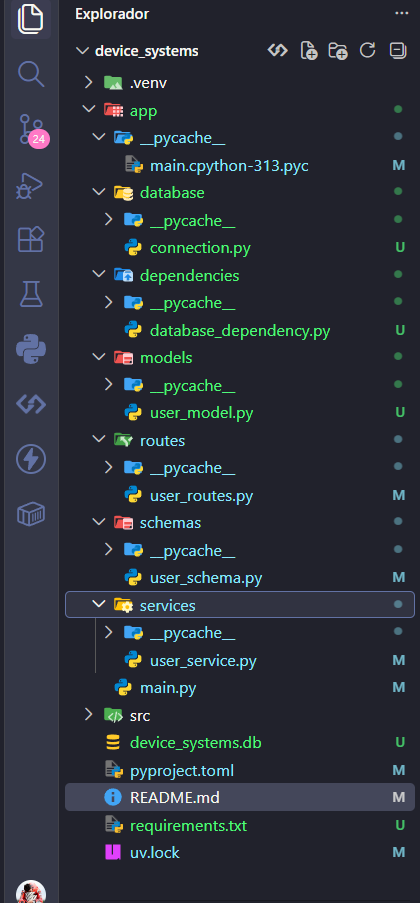

# Device Systems API

API REST desarrollada con **FastAPI**, **SQLAlchemy**, **Pydantic** y **SQLite** para la gestión de usuarios del sistema `device_systems`.

---

## 1. Descripción del proyecto

Device Systems API es una API REST orientada a la gestión de usuarios. Permite realizar operaciones de creación, consulta, filtrado, actualización y eliminación de usuarios mediante diferentes endpoints HTTP.

El proyecto utiliza:

* **FastAPI** para construir la API REST.
* **Uvicorn** como servidor ASGI.
* **SQLAlchemy** como ORM para interactuar con la base de datos.
* **Pydantic** para validar los datos de entrada y salida.
* **SQLite** como sistema de persistencia de datos.
* **Swagger UI** y **ReDoc** para la documentación automática de la API.

La API se ejecuta localmente mediante:

```text
http://127.0.0.1:8000
```

La documentación interactiva está disponible en:

```text
http://127.0.0.1:8000/docs
```

La documentación alternativa está disponible en:

```text
http://127.0.0.1:8000/redoc
```

---

# 2. Estructura del proyecto

La estructura principal del proyecto es:

```text
device_systems/
│
├── app/
│   ├── database/
│   │   └── connection.py
│   │
│   ├── dependencies/
│   │   └── database_dependency.py
│   │
│   ├── models/
│   │   └── user_model.py
│   │
│   ├── routes/
│   │   └── user_routes.py
│   │
│   ├── schemas/
│   │   └── user_schema.py
│   │
│   ├── services/
│   │   └── user_service.py
│   │
│   └── main.py
│
├── .venv/
├── img/
├── device_systems.db
├── pyproject.toml
├── uv.lock
├── requirements.txt
└── README.md
```

## Captura de la estructura del proyecto

La estructura permite separar las diferentes responsabilidades de la aplicación. Por ejemplo, los modelos representan las tablas de la base de datos, los schemas validan los datos y las rutas contienen los endpoints de la API.



---

# 3. Base de datos

Para la persistencia de información se utilizó **SQLite** junto con **SQLAlchemy**.

La base de datos generada es:

```text
device_systems.db
```

Dentro de la base de datos se encuentra la tabla:

```text
users
```

La tabla contiene información como:

| Campo        | Descripción                     |
| ------------ | ------------------------------- |
| `id`         | Identificador único del usuario |
| `name`       | Nombre del usuario              |
| `email`      | Correo electrónico              |
| `role`       | Rol del usuario                 |
| `is_active`  | Estado del usuario              |
| `created_at` | Fecha de creación               |

> **Nota:** agrega aquí una captura de la base de datos mostrando la tabla `users` cuando la tengas.

La persistencia permite que los usuarios permanezcan almacenados incluso después de detener o reiniciar el servidor.

---

# 4. Swagger UI

FastAPI genera automáticamente una interfaz de documentación utilizando Swagger UI.

La documentación puede consultarse en:

```text
http://127.0.0.1:8000/docs
```

Swagger permite visualizar y probar directamente los endpoints disponibles.

> **Nota:** agrega aquí una captura general de Swagger UI cuando la tengas.

En Swagger se pueden observar los endpoints relacionados con la gestión de usuarios, los schemas utilizados, los parámetros y las respuestas de la API.

La documentación alternativa también puede consultarse mediante:

```text
http://127.0.0.1:8000/redoc
```

---

# 5. Endpoints de usuarios

Los principales endpoints implementados son:

| Método | Endpoint      | Función                     |
| ------ | ------------- | --------------------------- |
| POST   | `/users/`     | Crear usuario               |
| GET    | `/users/`     | Listar usuarios             |
| GET    | `/users/{id}` | Consultar usuario           |
| PUT    | `/users/{id}` | Actualizar usuario completo |
| PATCH  | `/users/{id}` | Actualizar parcialmente     |
| DELETE | `/users/{id}` | Eliminar usuario            |

También se implementan filtros mediante parámetros de consulta, como el rol y el estado activo del usuario.

---

# 6. Evidencia de pruebas funcionales

## 6.1 Crear usuario válido

Se realizó una petición:

```http
POST /users/
```

con los siguientes datos:

```json
{
  "name": "sara alvarez",
  "email": "saraalvarez@example.com",
  "role": "user",
  "is_active": true
}
```

La API respondió correctamente con:

```text
201 Created
```

Respuesta obtenida:

```json
{
  "id": 1,
  "name": "sara alvarez",
  "email": "saraalvarez@example.com",
  "role": "user",
  "is_active": true
}
```

### Evidencia


La prueba demuestra que la API permite crear correctamente un usuario y almacenarlo en la base de datos.

---

## 6.2 Intentar crear un usuario con email repetido

Se realizó nuevamente una petición utilizando el mismo correo electrónico:

```json
{
  "name": "sara alvarez",
  "email": "saraalvarez@example.com",
  "role": "user",
  "is_active": true
}
```

El sistema verifica que el correo electrónico ya exista antes de crear un nuevo registro.

### Evidencia


Esta prueba permite comprobar el manejo de registros duplicados mediante un error controlado.

---

## 6.3 Listar usuarios

Se ejecutó:

```http
GET /users/
```

El endpoint permite consultar los usuarios almacenados en la base de datos.

La respuesta esperada es:

```text
200 OK
```

### Evidencia


La prueba permite comprobar que la API puede consultar los registros almacenados en SQLite.

---

## 6.4 Consultar usuario por ID

Se ejecutó:

```http
GET /users/1
```

El endpoint devuelve la información correspondiente al usuario cuyo identificador es `1`.

La respuesta esperada es:

```text
200 OK
```

### Evidencia


Esta prueba demuestra que es posible consultar un usuario específico mediante su identificador.

---

## 6.5 Consultar usuario inexistente

Se realizó una consulta utilizando un ID que no existe:

```http
GET /users/999
```

La API debe devolver:

```text
404 Not Found
```

Esto corresponde a un error controlado porque el recurso solicitado no existe.

### Evidencia


Esta prueba permite verificar el manejo de recursos que no se encuentran registrados en la base de datos.

---

## 6.6 Filtrar usuarios por rol

Se realizó una consulta utilizando el parámetro correspondiente al rol:

```http
GET /users/?role=user
```

La API devuelve los usuarios que corresponden al rol solicitado.

### Evidencia


Esta funcionalidad permite consultar usuarios de acuerdo con su rol dentro del sistema.

---

## 6.7 Filtrar usuarios activos

Se realizó una consulta utilizando:

```http
GET /users/?is_active=true
```

El resultado contiene los usuarios cuyo estado se encuentra activo.

### Evidencia


Esta prueba permite comprobar el filtrado de usuarios mediante su estado de actividad.

---

## 6.8 Actualizar usuario completo con PUT

Se utilizó:

```http
PUT /users/1
```

Ejemplo de información enviada:

```json
{
  "name": "Sara Alvarez Actualizada",
  "email": "saraalvarez@example.com",
  "role": "admin",
  "is_active": true
}
```

El método `PUT` permite actualizar completamente la información del usuario.

La respuesta esperada es:

```text
200 OK
```

### Evidencia


Esta prueba demuestra la actualización completa de un registro existente.

---

## 6.9 Actualización parcial con PATCH

Se utilizó:

```http
PATCH /users/1
```

Por ejemplo:

```json
{
  "name": "Sara Alvarez PATCH"
}
```

El método `PATCH` permite modificar solamente los campos enviados, conservando los demás valores.

La respuesta esperada es:

```text
200 OK
```

### Evidencia


Esta prueba demuestra la actualización parcial de la información de un usuario.

---

## 6.10 Eliminar usuario

Se utilizó:

```http
DELETE /users/1
```

El endpoint elimina el usuario de la base de datos.

La respuesta esperada es:

```text
204 No Content
```

### Evidencia


Esta prueba permite comprobar la eliminación de un registro mediante el método HTTP `DELETE`.

---

## 6.11 Verificar que el usuario eliminado ya no existe

Después de eliminar el usuario se realizó nuevamente:

```http
GET /users/1
```

La API debe responder:

```text
404 Not Found
```

Esto permite comprobar que el registro fue eliminado correctamente de la base de datos.

### Evidencia


Esta prueba confirma que el usuario eliminado ya no puede ser consultado.

---

# 7. Errores controlados

Durante las pruebas se verificaron diferentes situaciones que deben ser manejadas por la API.

## Email duplicado

Cuando se intenta registrar un correo que ya existe, la API debe devolver un error controlado.

La implementación utilizada contempla:

```text
400 Bad Request
```

### Evidencia


---

## Usuario inexistente

Cuando se consulta un ID que no existe, la API devuelve:

```text
404 Not Found
```

### Evidencia


Esto informa correctamente que el recurso solicitado no está disponible.

---

## Datos inválidos

FastAPI utiliza Pydantic para validar los datos recibidos.

Cuando la información enviada no cumple las reglas definidas por el schema, FastAPI puede responder:

```text
422 Unprocessable Entity
```

Esta validación permite evitar que datos incorrectos lleguen a la lógica de negocio o a la base de datos.

---

# 8. Diferencia entre modelo SQLAlchemy y schema Pydantic

Una parte importante del proyecto es diferenciar el **modelo SQLAlchemy** del **schema Pydantic**.

## Modelo SQLAlchemy

El modelo SQLAlchemy representa la estructura de una tabla dentro de la base de datos.

Por ejemplo:

```python
class User(Base):
    __tablename__ = "users"

    id = Column(Integer, primary_key=True)
    name = Column(String)
    email = Column(String, unique=True)
    role = Column(String)
    is_active = Column(Boolean)
```

Este modelo se encarga de representar y manipular los datos almacenados en SQLite.

En otras palabras:

```text
SQLAlchemy Model
       ↓
Base de datos
       ↓
Tabla users
```

---

## Schema Pydantic

El schema Pydantic se utiliza para validar y estructurar los datos que entran y salen de la API.

Por ejemplo:

```python
class UserCreate(BaseModel):
    name: str
    email: EmailStr
    role: str
    is_active: bool = True
```

Este schema permite comprobar que los datos enviados por el cliente tengan el formato esperado.

En otras palabras:

```text
Petición HTTP
      ↓
Pydantic Schema
      ↓
Validación
      ↓
SQLAlchemy Model
      ↓
Base de datos
```

---

## Diferencia principal

| SQLAlchemy                   | Pydantic                              |
| ---------------------------- | ------------------------------------- |
| Representa la tabla          | Representa los datos de la API        |
| Trabaja con la base de datos | Valida los datos                      |
| Define columnas              | Define campos y tipos                 |
| Se utiliza para persistencia | Se utiliza para entrada y salida      |
| Interactúa con SQLite        | Interactúa principalmente con FastAPI |

Ambos cumplen funciones diferentes y complementarias dentro de la aplicación.

---

# 9. Persistencia de datos

La persistencia es importante porque permite que los datos de una API no desaparezcan cuando el servidor se detiene.

Si la aplicación solamente almacenara usuarios en memoria, los datos podrían perderse al reiniciar el servidor.

Al utilizar SQLite y SQLAlchemy:

```text
Cliente
   ↓
FastAPI
   ↓
Pydantic
   ↓
SQLAlchemy
   ↓
SQLite
   ↓
device_systems.db
```

los usuarios quedan almacenados de forma persistente.

Por ejemplo, después de crear:

```json
{
  "name": "sara alvarez",
  "email": "saraalvarez@example.com"
}
```

el registro queda almacenado en la base de datos y puede consultarse posteriormente.

La persistencia permite que la información continúe disponible aunque el servidor sea detenido y posteriormente iniciado nuevamente.

---

# 10. Reflexión final

El desarrollo de esta API permitió comprender la importancia de combinar diferentes herramientas para construir un sistema organizado y funcional.

FastAPI facilita la creación de endpoints y genera automáticamente la documentación mediante Swagger UI. Pydantic permite validar los datos antes de procesarlos, mientras que SQLAlchemy facilita la comunicación entre la aplicación y la base de datos.

La persistencia es especialmente importante porque permite conservar la información de los usuarios aunque el servidor se reinicie. Esto hace que la API sea más útil para aplicaciones reales, donde los datos deben permanecer disponibles y consistentes.

También fue importante implementar errores controlados, como el intento de registrar un email que ya existe o consultar un usuario inexistente. Esto permite que la API responda de manera clara ante diferentes situaciones y evita comportamientos inesperados.

Finalmente, la separación entre modelos SQLAlchemy, schemas Pydantic, servicios y rutas permite mantener una estructura más organizada, facilitando el mantenimiento, las pruebas y futuras ampliaciones del proyecto.

---

# 11. Resumen de pruebas

| #  | Prueba                | Resultado esperado | Evidencia |
| -- | --------------------- | ------------------ | --------- |
| 1  | Crear usuario válido  | 201 Created        | ✅         |
| 2  | Email repetido        | 400 Bad Request    | ✅         |
| 3  | Listar usuarios       | 200 OK             | ✅         |
| 4  | Consultar por ID      | 200 OK             | ✅         |
| 5  | Usuario inexistente   | 404 Not Found      | ✅         |
| 6  | Filtrar por rol       | 200 OK             | ✅         |
| 7  | Filtrar activos       | 200 OK             | ✅         |
| 8  | Actualizar con PUT    | 200 OK             | ✅         |
| 9  | Actualizar con PATCH  | 200 OK             | ✅         |
| 10 | Eliminar usuario      | 204 No Content     | ✅         |
| 11 | Verificar eliminación | 404 Not Found      | ✅         |

---

# 12. Conclusión

Las pruebas realizadas permiten verificar el funcionamiento de las operaciones principales de la API de usuarios, incluyendo creación, consulta, filtrado, actualización y eliminación.

La utilización de FastAPI, Pydantic, SQLAlchemy y SQLite permite implementar una API con validación, persistencia, documentación automática y manejo de errores controlados.

Las capturas incluidas en este documento sirven como evidencia del funcionamiento de cada endpoint y de las pruebas realizadas durante el desarrollo.

La implementación también permite comprender el flujo completo de una API REST:

```text
Cliente
   ↓
Endpoint FastAPI
   ↓
Schema Pydantic
   ↓
Servicio
   ↓
Modelo SQLAlchemy
   ↓
SQLite
   ↓
Respuesta HTTP
```

De esta manera, el proyecto integra conceptos de desarrollo de APIs, validación de datos, persistencia, arquitectura por capas, documentación y pruebas funcionales.
